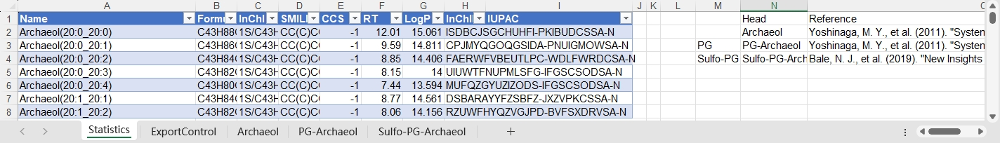
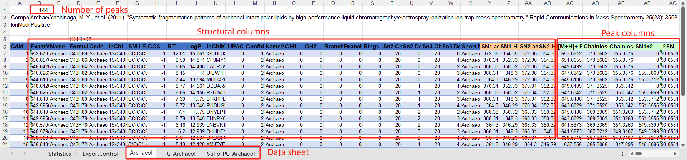
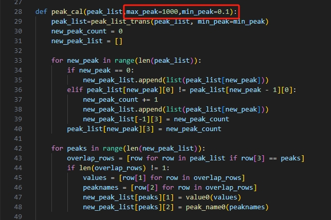

# Archaeal_lipid_MS2_library
This program is designed to create an MS2 library for lipidomic analysis. 
## 1. Prepare your data as the template file shows: Diether-template.xlsm/Tetraether-template.xlsm
- **Statistic Sheet**: 
Save the additional information of the molecules: eg., Formula, inchi, Smile, references. This information will not affect the exportation result.
<div align=center>

</div>
- **Export Controller Sheet**:
This sheet decides which sheets will be exported. The sheet number of the MS2 sheet is recorded in column A (the sheet name can be recorded in column B for clarity). The exportation program reads the maximum and minimum values in column A, and the data sheets in between will be exported.
<div align=center>

</div>
- **Data Sheets**:
### Each lipid class should be stored in a unique datasheet. The format should follow these rules:
- The first 5 rows record the general information of this molecule and the sheet. and the 6th row records the title of the column
- Start from the 7th row, each row records an individual molecule to be exported.
- The first 28 columns (A to AB) represent the general information of the molecules and the structural information to be exported.
- The peak information (X peaks) of the molecules’ MS2 is saved in the following peak columns. Columns from 29 to 28+X record the m/z value of the peak, and columns from 29+X to 28+2*X record the peak height. In one datasheet, all molecules should have the same peak columns. A 0 value can be used and will be ignored during the exportation.
<div align=center>

</div>
## 2. Install package dependencies
- This program is up-to-date to work with Python 3.12
- tqdm (https://github.com/tqdm/tqdm）
- openpyxl (https://openpyxl.readthedocs.io/)
```
pip install tqdm
pip install openpyxl
```
## 3. Export the library
Save your data file in the folder: **Files_for_construction**.
Then you can export the library by running the **PoolExport.py** script with the default setting. The exported .msp library files can be found in **Exported_msp** folder.
```
python PoolExport.py
```
You can edit the following scripts to modify the parameters for exportation.
### **PoolExport.py** controls the overall parameters during the exportation.
<div align=center>

</div>
- **folder_path**: Specify the directory of the .xlsm data files.
- **include_path**: "1" only read the datafile in folder_path. "2" also read the datafile in the subfolders of the folder_path.
- **export_path**: Specify the directory of the exportated files.
- **fix_file**: "True": Standardize the MS2 in the MSP library, unify the maximum peak, remove replicate peaks, and remove low peaks. "False": Do not standardize the MS2.
- **merge_at_end**: "True": Combine all the exported files into one file. "False": Do not combine files.
- **merge_while_processing** (More efficient than **merge_at_end** method, but the result file will not in the original order): True: Combine files while exporting files. 
False: Do not combine files while exporting.
- **threads**: Threads number used in this exportation. Use "0" for the maximum threads.
### **SingleExport.py** controls the exportation of a single data file.
- **importadduct()**: Specify the adduct ion of the library to be exported.
<div align=center>

</div>
- **single_msp_export()**: Lines 49-62 specify the structural information in the data file to be exported.
<div align=center>

</div>
### **MSPfix.py** controls the standardization of the MS2 in MSP library.
<div align=center>

</div>
- **peak_cal()**: all peaks will be linearly transformed, and the maximum peak abundance will be set as the max_peak parameter. After the transformation, peak abundance lower than min_peak will be removed.
## Citation and acknowledgment:
This program is inspired and modified from Lipidblast. https://fiehnlab.ucdavis.edu/projects/LipidBlast

